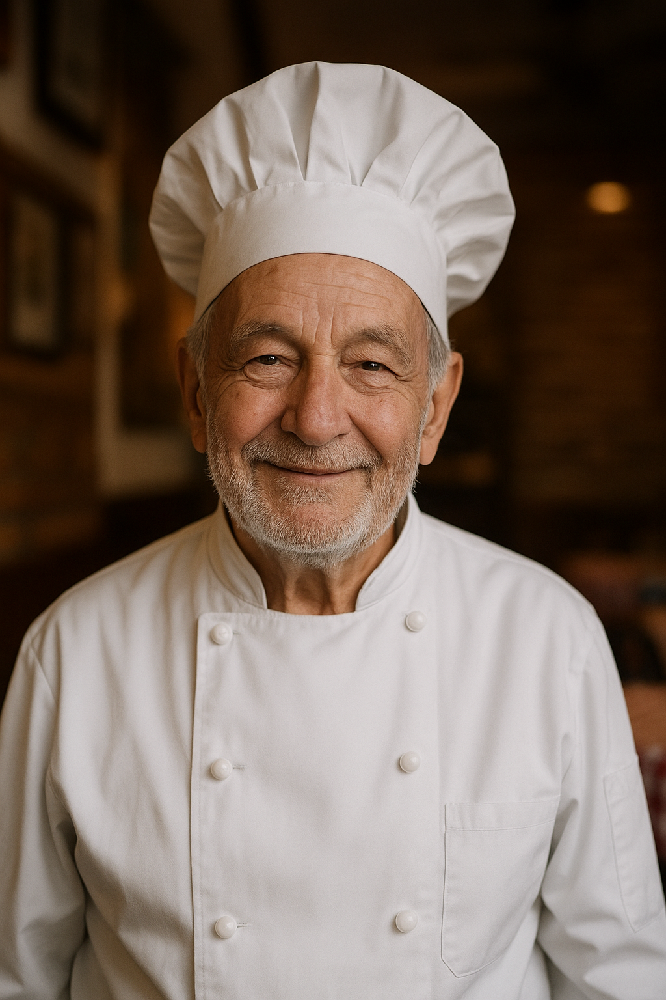

# 🍝 Proyecto: Aplicación para Restaurante de Comida Italiana

## 📌 Introducción
Como parte de este reto final de la beca otorgada por **Bécalos** y **DEV.F**, y con la guía de nuestro Sensei **Andrés Sánchez**, desarrollaremos una **aplicación web** para un restaurante de comida italiana.  
El sistema permitirá que los clientes puedan **registrarse y crear una cuenta**, **realizar reservaciones** y **hacer pedidos en línea** de forma rápida, sencilla y segura.

Para adentrarnos en un entorno más realista, también hemos planteado una problemática que buscaremos resolver: la necesidad de que los usuarios puedan eliminar o sustituir ingredientes en sus pedidos, ya sea por temas de alergias o por preferencias personales.

---

## 👥 Equipo de Desarrollo
- **Scrum Master:** [Nombre]
- **Development Team:** [Nombres]

---

## 👤 Historia del Cliente

 
  
  Nuestro cliente es <strong>Don Giovanni</strong>, un hombre de la tercera edad que ha sido dueño y chef de su restaurante italiano por más de 30 años.
  Su negocio ha sido un punto de encuentro para familias y amantes de la comida italiana en la ciudad, reconocido por su <strong>sabor auténtico y atención cercana</strong>.

  Con el paso del tiempo, Don Giovanni ha visto la necesidad de <strong>modernizar su servicio</strong> para llegar a más clientes y facilitar la experiencia de quienes ya lo visitan.  
  Entre las principales necesidades que nos compartió se encuentran:
  <ul>
    <li><strong>Registro de clientes</strong> para que puedan tener una cuenta y acceder a pedidos y reservas personalizadas.</li>
    <li><strong>Reservas en línea</strong> para evitar saturación del restaurante y organizar mejor los turnos.</li>
    <li><strong>Pedidos a domicilio</strong> de forma digital, evitando llamadas telefónicas.</li>
    <li><strong>Personalización de platillos</strong> por alergias o gustos personales.</li>
  </ul>

- **Registro de clientes** para que puedan tener una cuenta y acceder a pedidos y reservas personalizadas.
- **Reservas en línea** para evitar saturación del restaurante y organizar mejor los turnos.
- **Pedidos a domicilio** de forma digital, evitando llamadas telefónicas.
- **Personalización de platillos** por alergias o gustos personales.

---

## 🌟 Sprint Planning 
1. Crear un sistema de **registro y autenticación de usuarios**.
2. Implementar un sistema de **reservaciones en línea**.
3. Implementar un **módulo de pedidos a domicilio** con opción de personalización.
4. Diseñar una interfaz **amigable, responsiva y accesible**.
5. Garantizar la **seguridad de los datos** de los usuarios.

---

## 📋 Product Backlog
1. **Registro de clientes**
   - Como cliente, quiero **registrarme y crear una cuenta** para poder hacer pedidos y reservaciones de forma personalizada.
2. **Inicio de sesión**
   - Como cliente registrado, quiero **iniciar sesión** para acceder a mis pedidos y reservas guardadas.
3. **Reservaciones**
   - Como cliente, quiero **reservar una mesa** en línea para asegurarme de tener un lugar disponible cuando llegue.
4. **Pedidos a domicilio**
   - Como cliente, quiero **hacer un pedido en línea** para recibir mi comida en casa sin tener que llamar.
5. **Personalización de platillos**
   - Como cliente, quiero **quitar o sustituir ingredientes** al hacer mi pedido para evitar alergias o por preferencias personales.
6. **Confirmación de pedido o reserva**
   - Como cliente, quiero recibir **una confirmación digital** de mi pedido o reserva para estar seguro de que fue registrado correctamente.

---

## 💪 Sprint Backlog (Tareas)

