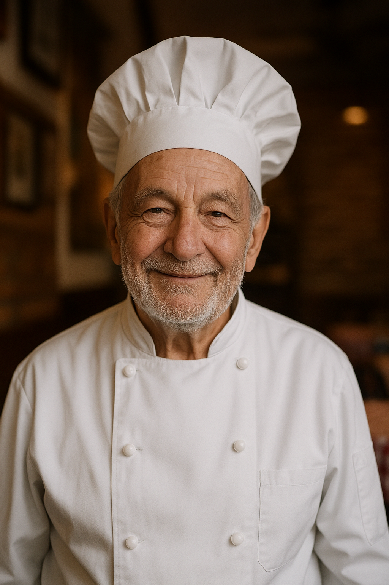

## 👤 Historia del Cliente

 
  
  Nuestro cliente es <strong>Don Giovanni</strong>, un hombre de la tercera edad que ha sido dueño y chef de su restaurante italiano por más de 30 años.
  Su negocio ha sido un punto de encuentro para familias y amantes de la comida italiana en la ciudad, reconocido por su <strong>sabor auténtico y atención cercana</strong>.

  Con el paso del tiempo, Don Giovanni ha visto la necesidad de <strong>modernizar su servicio</strong> para llegar a más clientes y facilitar la experiencia de quienes ya lo visitan.  
  Entre las principales necesidades que nos compartió se encuentran:
  <ul>
    <li><strong>Registro de clientes</strong> para que puedan tener una cuenta y acceder a pedidos y reservas personalizadas.</li>
    <li><strong>Pedidos a domicilio</strong> de forma digital, evitando llamadas telefónicas.</li>
    <li><strong>Personalización de platillos</strong> por alergias o gustos personales.</li>
  </ul>

